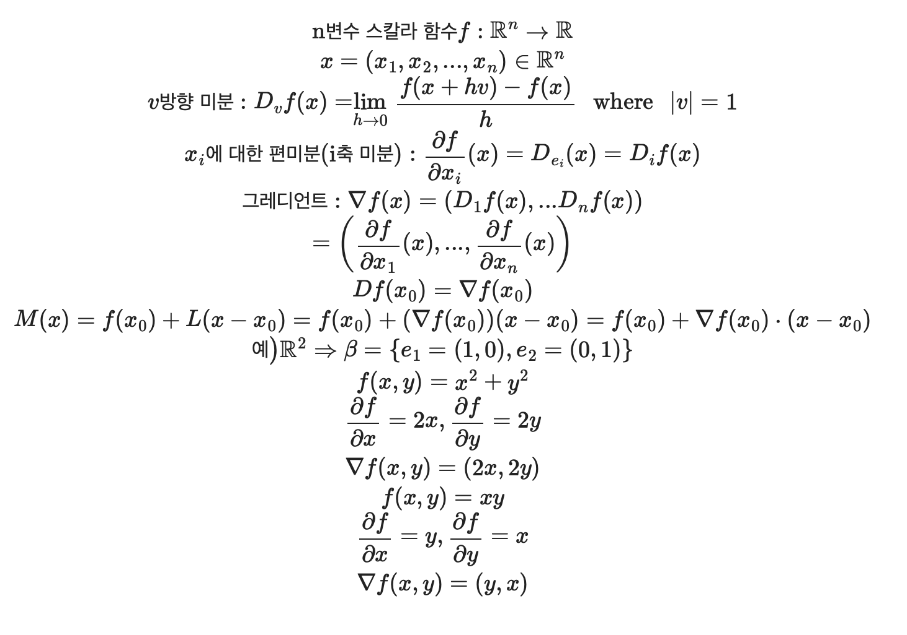
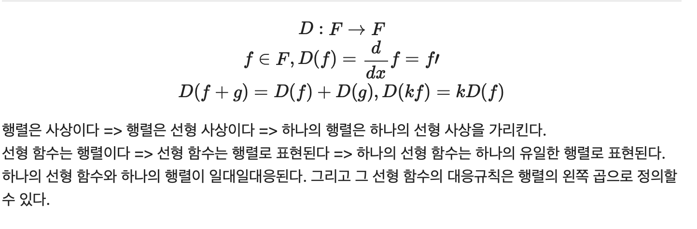
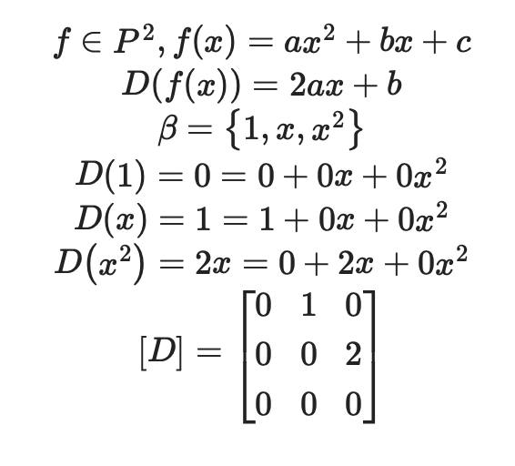
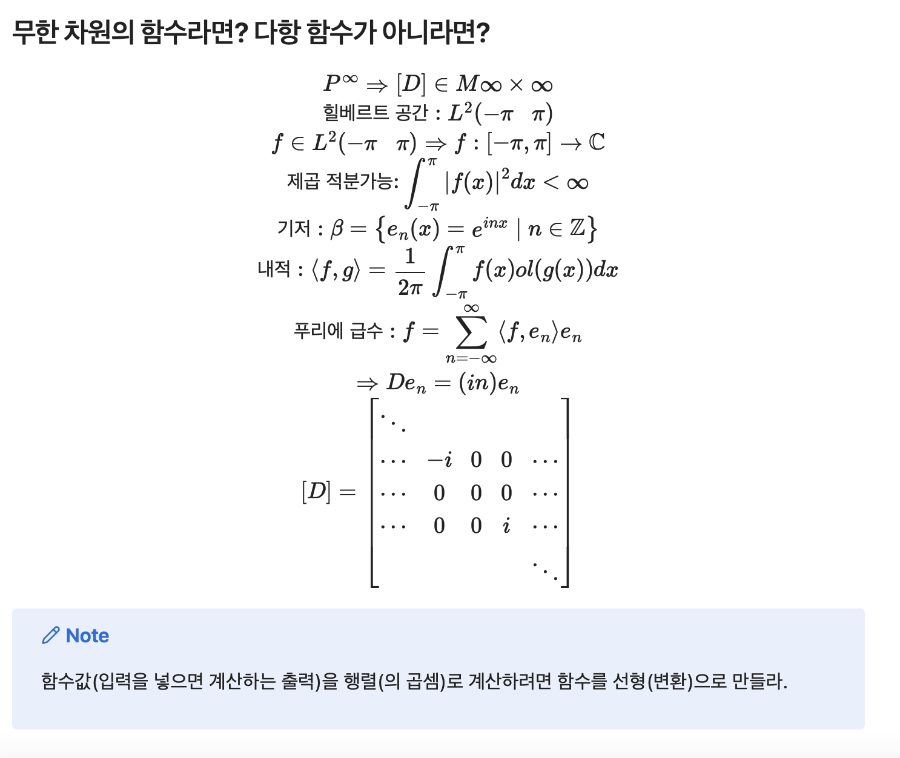
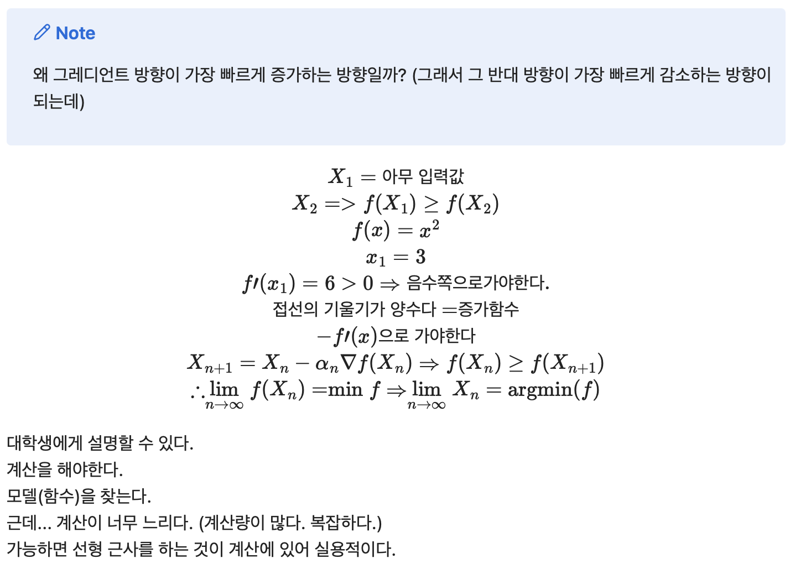

### 스크럼

                  ╱|、
                (˚ˎ 。7
                 |、˜〵  ~ 💗 💕 💗 
                じしˍ,)ノ

- 학습 목표 1 : 오전 심화 강의 듣기  
- 학습 목표 2 : 데이터 시각화 복습

### 새로 배운 내용
#### 주제 1: **미분 복습**
* $f = R → R, y = f(x)$
→ 정의역과 공역이 모두 실수인 함수

* $x_0$ $in$ $dom(f)$ = $R$: "기준" → $x$ $in$ $dom(f)$ $=$ $R$: "변화"

* $x - X_0 = X변화량(기준으로부터 변화까지의 차이)" → f(x) - f(xO) = y 변화량(함수값의 차이)"$
\

* "평균 변화율의 극한" = $\displaystyle\lim_{X → x_O}$ $f(x) - f(x_o)\over(x-X_O)$ = $X_0$에서의 순간 변화율 = 미분계수

* $f'(x)$ = $f$의 도함수 = $f$의 $×$에서의 미분계수를 출력하는 함수
* $x_0 = 1$ ➡ $\displaystyle\lim_{X → 1}$ $(x^2 - 1)\over(x-1)$ = $\displaystyle\lim_{X → 1}$ $(x + 1)$ = 2 = $f'(1)$
* $f'(x) = 2x ➡ f'(1) = 2\times1 = 2$

<기억할 것>
* 미분, 다항식의 미분법(도함수 구하는 법) 기억이 안나면 꼭 보고 오기
* 미분(한다)
  * 미분계수를 구한다.
  * 도함수를 구한다.
* scale-up = 하나의 성능이 높아지는 것
* scale-out = 같은 성능의 것을 여러개 합치는 것

> [note] 여러분의 수학이 일변수에서 다변수로 스케일업 되어야한다.

#### 주제 2: **다변수 함수의 미분**
* 공역(출력)을 기준으로 하는 함수의 종류

$$
1. 스칼라 함수: 종속 변수가 스칼라 값인 함수
\\
실함수 f:X → R
\\
복소함수 g: X → C
\\
2. 벡터 함수
\\
벡터 장(field) h: X → V
$$

* 정의역(입력)을 기준으로 하는 함수의 종류와 미분
  * 일변수에서의 미분계수(평균값에서의 극한값): 실수
  * 다변수에서의 미분계수: 수가 아니라 “함수” (선형변환)

#### 주제 3: **편미분과 방향미분**

#### 주제 4: ****미분이라는 함수(미분연산자)는 선형일까?**

#### 주제 5: ****그럼 미분도 행렬인가?

#### 주제 6: 경사하강법

### 오늘의 도전 과제와 해결 방법
- 도전 과제 1: 없음

### 오늘의 회고
* 수학 공부 더 열심히 하기 (특히) 선형대수
* 수학(알고리즘)은 계산을 줄여준다.

### 참고 자료 및 링크
- [수식 노트](https://iasandcb.netlify.app/site/tech/kdt-pangyo-ai-2/2025-02-17)
- [그래프](https://www.desmos.com/calculator/hh2v1eghke?lang=ko)
- [마크다운 표기법](https://velog.io/@d2h10s/LaTex-Markdown-%EC%88%98%EC%8B%9D-%EC%9E%91%EC%84%B1%EB%B2%95)