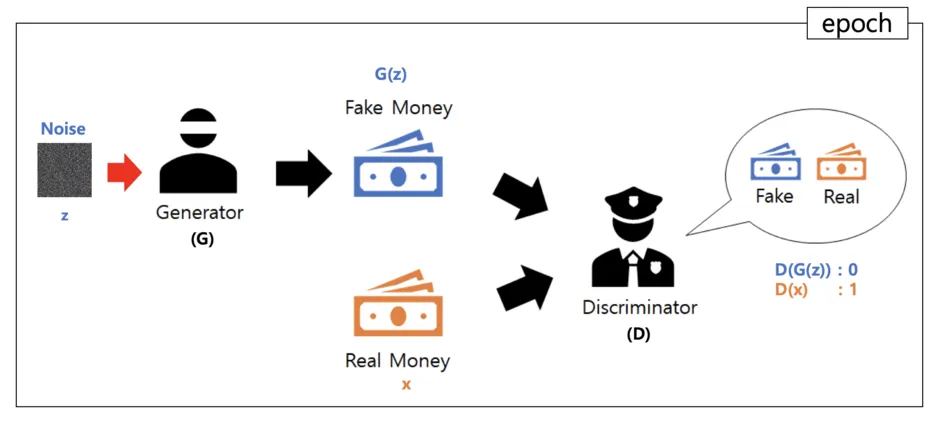

### 스크럼

                  ╱|、
                (˚ˎ 。7
                 |、˜〵  ~ 💗 💕 💗 
                じしˍ,)ノ

- 학습 목표 1 : 오전 심화 강의 듣기  
- 학습 목표 2 : 미니퀘스트

### 새로 배운 내용
#### 주제 1: **알아두면 좋은 정보**

> 1. Data Augmentation
* 일반화 성능 향상
* 도메인 확장
* 실제 환경 대응

> 2. i o i : international olympiad in informatics
* ioi를 잘하려면 전분야의 엄청난 training?

> 3. 과도한 데이터 증강?
* 불필요한 노이즈 증가
* 중복 데이터 초래 -> 과적합
* 불필요한 변형으로 인한 왜곡 

> 4. GAN(generative adversarial networks)
* Z (노이즈): 위조자가 가짜 이미지를 생성할 때 사용하는 임의의 입력 값
* G (위조자): 노이즈 z를 받아 가짜 이미지를 생성하는 모델
* G(z) (가짜이미지): 위조자가 생성한 가짜 이미지
* x (진짜 이미지): 실제 데이터
* D (판별자): 입력된 이미지가 진짜인지 가짜인지 구별하는 모델
* D(G(z)) : 0 - 판별자가 가짜 이미지 ( G(z) ) 를 가짜로 인식
* D(x) : 1 - 판별자가 진짜 이미지를 진짜로 인식

링크: https://baechu-story.tistory.com/12

> 5. dataset split
* 검증 데이터는 필수가 아니다
* 트레이닝 데이터가 적은 경우 검증 데이터 없이 cross-validation과 같은 기법을 통해 모델의 성능을 평가할 수 있다.
    * Cross validation: 트레이닝 데이터에서 일정 부분을 검증 데이터로 분할해 여러 번 검증하는 것을 의미
    * 일반적으로 k-fold 교차 검증 있음.

### 오늘의 도전 과제와 해결 방법
- 도전 과제 1: 없음

### 오늘의 회고
* 해커톤 막막하다

### 참고 자료 및 링크
- [GAN](https://baechu-story.tistory.com/12
)
