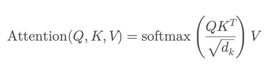

### 스크럼

                  ╱|、
                (˚ˎ 。7
                 |、˜〵  ~ 💗 💕 💗 
                じしˍ,)ノ

- 학습 목표 1 : 오전 강의 듣기 (랭체인)  
- 학습 목표 2 : 랭체인 복습
- 학습 목표 3 : 과제 1번

### 새로 배운 내용
#### 주제 1: **✅ 트랜스포머(Transformer) 모델 파라미터 구성**
> 트랜스포머는 시퀀스 데이터를 처리하는 대표적인 신경망 모델

**구성 요소**
1. 인코딩(Encoding)과 디코딩(Decoding)

    • 인코딩

    입력 데이터를 벡터(임베딩, embedding) 형태로 변환하여 모델이 처리 가능한 형태로 압축합니다.
주로 텍스트나 시계열 데이터를 고차원의 벡터 표현으로 변환합니다.

    • 디코딩

    인코더에서 생성된 잠재적 표현(벡터)을 바탕으로 목표 시퀀스를 생성합니다.
번역, 요약, 텍스트 생성 등 결과를 만드는 역할을 담당합니다.

    즉, 인코딩이 입력을 압축하고 이해하는 과정이라면, 디코딩은 이를 풀어 최종 결과물을 만드는 과정입니다.

2. 어텐션 메커니즘
* 목적: 입력 데이터의 중요한 부분에 가중치를 두어 집중하는 방식

* 특징:

	•	문장이나 단어 간의 관계를 효과적으로 반영합니다.

	•	장거리 의존성(Long-range dependencies)을 효율적으로 학습할 수 있게 합니다.

	•	Query(Q), Key(K), Value(V) 행렬을 활용하여 입력 간 상호작용을 계산합니다.

	•	셀프 어텐션(Self-Attention)
자기 자신 내부의 시퀀스 요소 간 중요도를 계산하는 방식입니다.

	•	멀티헤드 어텐션(Multi-head Attention)
여러 개의 독립적인 어텐션을 병렬로 수행하여 다양한 관점에서 데이터를 학습합니다.

3. feed forward 네트워크

	•	어텐션 이후 데이터를 추가로 처리하여 비선형적 특성을 더해주는 네트워크입니다.

	•	위치 단위로 독립적으로 계산되며, 각 위치의 벡터를 개별적으로 변환합니다.

	•	일반적으로 두 개의 선형 레이어와 활성화 함수(ReLU, GELU 등)로 구성됩니다.

    • FFN(x) = max(0, xW_1 + b_1)W_2 + b_2

#### 주제 2: **✅ 프로젝트 내 역할 분담**
AI 개발자(엔지니어)
- ai 모델을 기반으로 실제 서비스 가능한 애플리케이션 구축
- 랭체인 등 프레임워크를 이용하여 LLM 기반의 RAG 애플리케이션 개발
- 데이터 조회(fetch, retrieve) 및 결과 출력 기능 구현

AI 모델러 (리서처, 디자이너, 아키텍트, 설계자)
- ai model 구조 설계 및 아키텍처 구상
- 모델을 파이토치 등으로 설계, 학습 및 미세 조정
- 허깅페이스에서 제공하는 트랜스포머 모델 선택 및 활용

#### 주제 3: **✅ AI 애플리케이션의 기술 구도**
PyTorch
- 모델 구축 및 학습을 위한 기본적인 딥러닝 라이브러리

LangChain
- RAG(Retrieval-Augmented Generation) 기술 지원 프레임워크
- 외부 문서를 검색하고 요약하여 LLM에 전달하는 역할

HuggingFace
- 트랜스포머 기반 모델 및 데이터셋 제공 플랫폼
- 다양한 pretrained LLM 모델 (GPT, BERT 등)을 제공

**전체적인 ai 애플리케이션의 흐름**
- 데이터 조회(fetch, retrieve) → LangChain으로 문서 처리(RAG) → 허깅페이스에서 가져온 트랜스포머 모델(LLM)로 처리 → PyTorch를 통해 미세조정 및 배포

#### 주제 4: **✅ 추가 용어 정리 및 보충 설명**
	• fetch, retrieve: 
    조회(검색하여 가져오기). 데이터베이스나 문서에서 데이터를 가져오는 행위를 말합니다.

	• 위치 벡터(Position Vector):
	
        • 원점(기준점)을 기준으로 특정 지점까지의 상대적 위치를 나타내는 벡터.
	    • NLP에서는 문장 내에서의 단어의 상대적 위치를 나타내는 ‘위치 임베딩(Position Embedding)’으로 활용됩니다.

	• seq2seq(sequence to sequence):
	    • 입력 시퀀스를 다른 시퀀스로 변환하는 모델 (예: 번역, 요약 등)
	    • Transformer, RNN 기반의 모델에서 자주 사용되며, 특히 Completion(완성형) 태스크의 초석이 되는 구조

	• Embedding vs Imbedding (발음: 임베딩):
	    • 두 단어 모두 비슷한 의미로 사용
	    • NLP 분야에서는 일반적으로 Embedding이 더 표준적으로 사용되며, 데이터(특히 텍스트)를 벡터 공간에 매핑하여 표현하는 기법을 의미

### 오늘의 도전 과제와 해결 방법
- 도전 과제 1: 

### 오늘의 회고
* 아침부터 잠에 이기지 못하고 자버림

### 참고 자료 및 링크
- [Attention Mechanism](https://velog.io/@sjinu/개념정리-Attention-Mechanism)